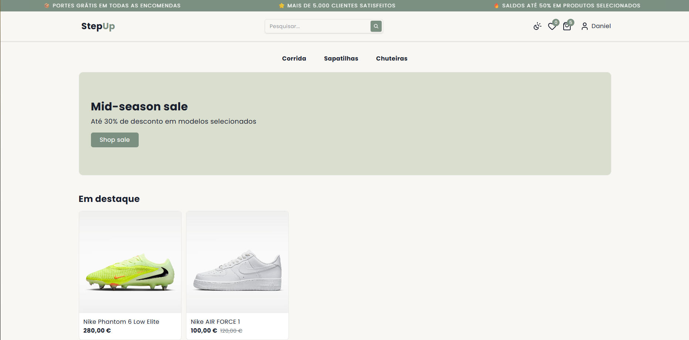
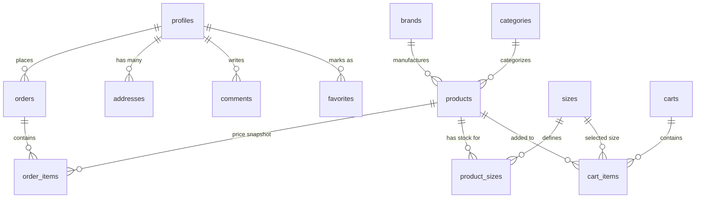

# 👟 StepUp


**StepUp** é uma aplicação moderna de e-commerce de calçado, desenvolvida para demonstrar uma arquitetura web limpa e escalável, utilizando tecnologias modernas.

## 🚀 Demo Online

🔗 https://stepup-coral.vercel.app

## 📸 Screenshots



## 🧠 Objetivos do Projeto

- Praticar desenvolvimento frontend moderno com **Next.js e TypeScript**
- Construir um fluxo realista de **e-commerce**
- Aplicar boas práticas de código limpo e organização de pastas
- Trabalhar com autenticação e uma base de dados real
- Implementar um Dashboard Administrativo completo.

## ✨ Funcionalidades

### 👤 Autenticação

- Registo, login e gestão de perfil.
- Gestão de múltiplos endereços de envio.
- Lista de favoritos e carrinho persistente.
- Proteção de rotas

### 🛍️ Loja

- Listagem de produtos
- Página de detalhe do produto
- Filtragem de produtos
- Pesquisa de produtos
- Layout responsivo

### 🛒 Carrinho & Encomendas

- Adicionar e remover produtos do carrinho
- Atualizar quantidades dos produtos
- Persistência do carrinho
- Checkout simulado
- Criação de encomendas

### 🧑‍💼 Administração

- Dashboard de controlo de vendas
- Gestão dos produtos
- Gestão de inventário
- Gestão das encomendas e estados de envio

## 📂 Estrutura do Projeto

```
/actions                        # Server Actions (Next.js)

/app                            # App Router (Rotas Públicas e Admin)
  (public)
    /auth
      /check-email
      /forgot-password
      /login
      /reset-password
      /signup
    /cart
      /shipping
        /payment
    /favorites
    /products
      /[id]
        /edit
        /new
    /profile
      /change-password
      /my-address
      /my-favorites
      /my-orders
  admin
    /orders
    /products
      /[id]
    /users

/components                      # Componentes Reutilizáveis
  /admin
  /cart
  /favorites
  /layout
  /products
  /profile
  /ui

/hooks                           # React hooks costumizados

/lib
  /supabase
  /types
  /utils

/providers

/services                        # Lógica de comunicação com a DB


```

## 🗄️ Estrutura da Base de Dados

## 🗄️ Estrutura da Base de Dados

O projeto utiliza **PostgreSQL** com uma estrutura normalizada para garantir a integridade dos dados e escalabilidade. Abaixo encontras o modelo relacional das principais entidades:



## ⚙️ Como Executar o Projeto

### Pré-requisitos

- Node.js (v18 ou superior)
- npm ou yarn
- Conta no Supabase (https://supabase.com)

### Clonar o repositório e instalar dependências

```bash
git clone https://github.com/DannySF01/stepup.git
cd stepup
npm install
```

### Variáveis de Ambiente

Criar um ficheiro .env.local na raiz do projeto:

```env
NEXT_PUBLIC_SUPABASE_URL=supabase_url
NEXT_PUBLIC_SUPABASE_ANON_KEY=supabase_anon_key
```

### Executar em modo de desenvolvimento

```bash
npm run dev
```

## 📚 O Que Aprendi

Desenvolvimento de uma aplicação full-stack com Next.js

Gestão de autenticação e base de dados com Supabase

Estruturação de um projeto React escalável

Implementação de lógica real de e-commerce

Deploy de aplicações web com Vercel

---

## 👨‍💻 Autor

Desenvolvido por Daniel Fernandes

GitHub: https://github.com/DannySF01

LinkedIn: https://linkedin.com/in/daniel-f-874186115

---

## 📝 Licença

Este projeto foi desenvolvido exclusivamente para fins educativos.
